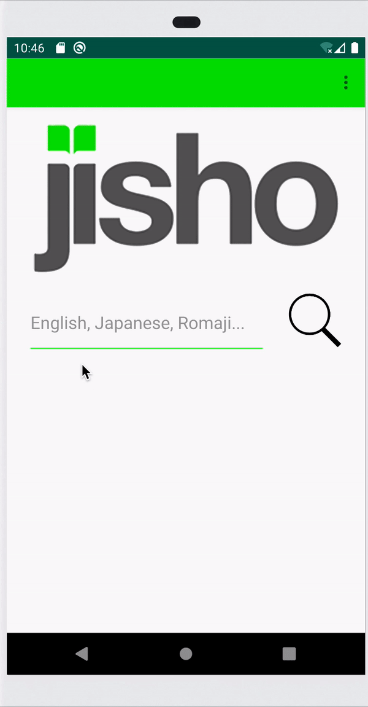

# Jisho Japanese-English Dictionary App for Android

## Disclaimer
This project was for learning purposes only. All credit is given to the original creators of Jisho for providing the API/databases. For more information, please see jisho.org/about

## Welcome
This is an Android application for Jisho. I made it after initially creating one for iOS. 

## Getting Started

To get started, go ahead and clone this repository to the location of your choosing by doing the following:

```
$ git clone https://github.com/reisturm/Jisho-Android.git
```

Once cloned, you should be able to open the project in Android Studio using a phone emulator of your choosing.

## Searching for Words

Using the application is straightforward. You can search in the following ways:
1) Type the Kanji/Hiragana characters i.e. 今日は
2) Type Romaji i.e. konnichiha
3) Type English words wrapped in double quotes i.e. "hello"



Do note that words not wrapped in quotes with be treated as Romaji in most cases. For example, if you type date, results relating to the pronouciation だて will appear. This is how the creators of Jisho implemented their search feature. 

## More on Jisho

For more information about about Jisho, please go to their website. 

https://jisho.org/

https://jisho.org/about
